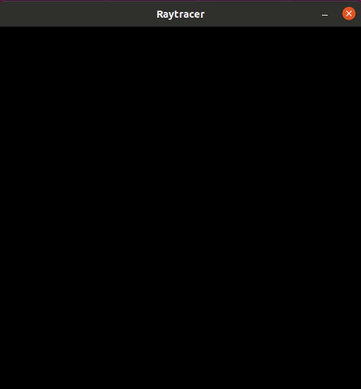
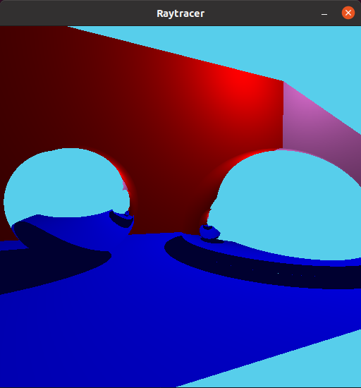

To run this program in linux type "make ./raytracer.c" within the engine folder and then a game file will be created outside of the folder.
Running the game file with this command "./game" will result in the program loading the scene file specified within the program and rendering the objects.
Two scene files are included in the scene folder though the scene creator is not finished. In order to switch scenes the text value must be changed in raytracer.c's main.

This program is a raytracing engine meaning that rays are cast from the camera position in order to determine the color of pixels on the screen.
It can render both triangles and spheres in any rgb color as well as make them reflective. As well as rendering lights with different hues.

Video

Images

